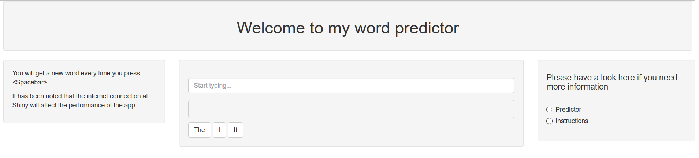

## Introduction

The Data Science Capstone course, offered by Johns Hopkins University, culminates in the creation of a predictive analytics application designed to predict the next word in a phrase. This brings together all the work done in the Data Science specialisation.

This presentation describes the use of Natural Language Processing, in combination with modelling and predictive analytics, in order to create this application. The main goal here is to showcase an application similar to the predictive texting of a typcial smartphone, where possible next words are suggest as the user types in a phrase.

--- .class #id 

## Natural Language Processing

Natural Language Processing (NLP) is a highly technical and analytic application of many forms of machine learning. Due to the fact the natural language usually does not follow any mathematical (or sometimes even logical) structure, modelling can be extremelly difficult.

It has been found that one of the simpler methods is to study a structured corpus of data, drawn from a large sample set, in order to start making basic predictions possible. Of these methods, the n-gram structuring of the corpus data has been shown to be both fairly easy to implement and reasonably accurate, although it does come at the price of having to handle very large data sets. This is the model used in this application.

--- .class #id

## Building the Model and Application

The model for this application was built using multiple n-grams in an effort to predict the next possible word. These are the steps that were followed:

1.  Data was download from [HC Corpora](www.corpora.heliohost.org)
2.  This corpus was then cleaned and profanity filtered
3.  Using the Quanteda R package, the corpus was then tokenised and turned in to various length n-gram structures
4.  Each n-gram structure (up to 6-grams) was analysed and trimmed for low-probability n-grams in order to keep the size low
5.  A prediction algorithm was written to use the (n-1)-gram for a phrase in order to predict the next word
6.  A Stupid Backoff algorithm was then added to increase the accuracy as well as provide a better overall feel
7.  Smoothing was added using the Good Turing method, but it was found that this added very limited accuracy

--- .class #id

## Using the Application

The application is designed to resemble the familiar smartphone text input. A user will start typing into the text box onscreen and the application will suggest possible words as he types. The suggestions will be shown in three buttons on the screen, each of which can be clicked to add that word to the sentence. The original design of the application allows for real-time updating of words as the user types, but unfortunately the Shiny platform is not quick enough for this to work over the Internet. In the final application hosted on [Shiny](https://rorymurphyza.shinyapps.io/Predictor/) the suggested words will only be loaded when the user presses the Spacebar. 

  

